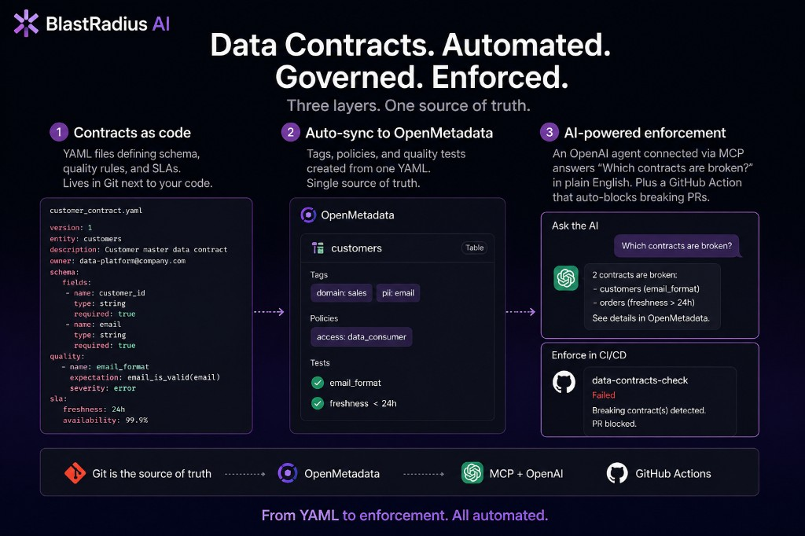
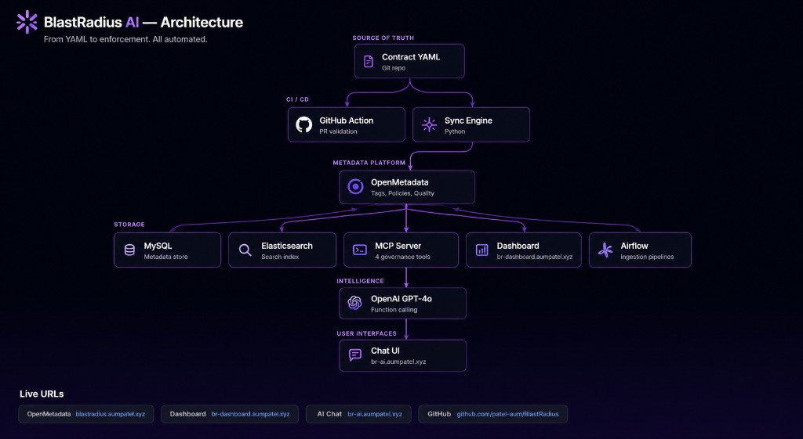

# BlastRadius AI

**Data Contracts. Automated. Governed. Enforced.**

BlastRadius AI enforces data contracts as code. Teams define schema, quality rules, and SLAs in YAML — automatically synced into OpenMetadata as tags, policies, and tests. An OpenAI-powered MCP agent detects schema drift in real time, and a GitHub Action blocks breaking changes before they hit production.

**Team Artemis** — Aum Patel & Simran

---

## Live Demo

Everything is deployed on AWS EC2 with Cloudflare HTTPS domains. Click any link below:

| Service | URL | 
|---------|-----|
| **OpenMetadata** | [blastradius.aumpatel.xyz](https://blastradius.aumpatel.xyz) |
| **Compliance Dashboard** | [br-dashboard.aumpatel.xyz](https://br-dashboard.aumpatel.xyz)  |
| **AI Chat Agent** | [br-ai.aumpatel.xyz](https://br-ai.aumpatel.xyz)  |
| **Airflow** | [br-airflow.aumpatel.xyz](https://br-airflow.aumpatel.xyz) |

### Quick Tour for Judges

1. **Start here** → [br-ai.aumpatel.xyz](https://br-ai.aumpatel.xyz) — Ask the AI: *"Which contracts are violated?"* and watch it query OpenMetadata in real time
2. **Dashboard** → [br-dashboard.aumpatel.xyz](https://br-dashboard.aumpatel.xyz) — See Domain Overview, Contract Details, SLA Tracker, and Violations page
3. **OpenMetadata** → [blastradius.aumpatel.xyz](https://blastradius.aumpatel.xyz) — Navigate to Explore → `demo_postgres` → `analytics_db` → `public` → `seller_transactions` to see auto-generated tags and governance metadata

### What's pre-loaded in the demo

- **3 data contracts** synced: `seller-transactions`, `buyer-orders`, `product-catalog`
- **Schema drift simulated** on `seller_transactions`: `currency` column removed, `payment_method` + `discount_pct` added without contract update
- **Tags auto-applied**: `DataContract.Active`, `finance`, `transactions`, `tier_1`, etc.
- **Governance policies** auto-created from contract role definitions

---

## Architecture

### Overview



### Technical Architecture



### How it works

```
Contract YAML (Git) → Sync Engine → OpenMetadata (Tags, Policies, Quality Tests)
                                          ↓
                              MCP Server (4 governance tools)
                                          ↓
                              OpenAI GPT-4o-mini (function calling)
                                          ↓
                              Chat UI / AI Agent / Dashboard
```

**Three layers:**

1. **Contracts as code** — YAML files (ODCS v3.1.0) defining schema, quality rules, SLAs, team ownership, and access roles
2. **Auto-sync to OpenMetadata** — One YAML creates classifications, tags, governance policies, and data quality test cases
3. **AI-powered enforcement** — OpenAI agent calls MCP tools to query contract compliance in plain English; GitHub Action blocks breaking PRs

---

## Quick Start (Local)

### Prerequisites

- Docker & Docker Compose v2
- Python 3.11+
- ~8 GB RAM allocated to Docker

### 1. Clone and start

```bash
git clone https://github.com/patel-aum/BlastRadius.git
cd BlastRadius
cp .env.example .env
# Add your OPENAI_API_KEY to .env for AI chat features
make up
```

Wait 3-5 minutes for OpenMetadata to initialize.

### 2. Seed demo data

```bash
make seed
```

### 3. Simulate a contract violation

```bash
make demo
```

### 4. Access services

| Service | Local URL |
|---------|-----------|
| OpenMetadata | http://localhost:8585 |
| Dashboard | http://localhost:8501 |
| AI Chat Agent | http://localhost:8000 |
| Airflow | http://localhost:8080 |

---

## How We Use OpenMetadata

OpenMetadata is the **enforcement engine** — not just a catalog. We use five API families:

| API | What we do with it |
|-----|--------------------|
| **Classifications & Tags** | Label tables with contract status (`Active`, `Violated`), domain tags (`finance`, `tier-1`) |
| **Governance Policies** | Auto-generate access rules from contract role definitions (reader, admin, engineer) |
| **Data Quality** | Create test cases from contract quality rules (row counts, null checks, uniqueness) |
| **Profiler** | Check actual table freshness and metrics against SLA thresholds |
| **Search** | Discover which tables are covered by contracts |

---

## MCP Tools

The MCP server exposes four tools callable by any AI agent (Cursor, Claude, GPT, etc.):

| Tool | Description |
|------|-------------|
| `validate_contract(name)` | Full compliance check: meta-schema, quality rules, SLA |
| `list_violations()` | All currently violated contracts across all domains |
| `get_contract_status(name)` | Health summary: drift, quality score, SLA status |
| `detect_drift(name)` | Schema drift: added/removed columns, type mismatches |

**AI Chat endpoint**: `POST /chat` — Natural language queries powered by OpenAI GPT-4o-mini with function calling. Ask anything about your contracts.

---

## CI/CD Integration

Two GitHub Actions pipelines:

### Contract Validation (`contract-validation.yml`)
Triggers on PRs that modify `contracts/*.yaml`:
1. Meta-schema validation
2. Breaking change detection (removed columns, type changes)
3. Posts detailed report as PR comment
4. Blocks merge if violations found

### Auto-Deploy (`deploy.yml`)
Triggers on push to `main`:
1. SSHes into EC2, pulls latest code
2. Rebuilds custom containers
3. Seeds demo data
4. Verifies all services are healthy

---

## Project Structure

```
├── contracts/                  # YAML data contracts (ODCS v3.1.0)
│   ├── seller-transactions.yaml
│   ├── buyer-orders.yaml
│   └── product-catalog.yaml
├── contract_engine/            # Core Python engine
│   ├── models.py               # Pydantic contract models
│   ├── om_client.py            # OpenMetadata REST API client
│   ├── sync.py                 # YAML → OpenMetadata sync
│   ├── validator.py            # Validation & breaking-change detection
│   └── drift.py                # Schema drift detection
├── mcp_server/                 # MCP + AI Chat server
│   ├── server.py               # FastMCP server + OpenAI agent + /chat endpoint
│   └── chat.html               # Chat UI (served at /)
├── dashboard/                  # Streamlit compliance dashboard
│   └── app.py
├── github-action/              # CI/CD contract validation
│   ├── validate.py
│   └── detect_breaking_changes.py
├── seed/                       # Demo seed scripts
│   ├── setup.py
│   └── demo_violation.py
├── infra/                      # AWS deployment
│   ├── cloudformation.yml
│   └── DEPLOY.md
├── .github/workflows/
│   ├── contract-validation.yml # PR validation pipeline
│   └── deploy.yml              # Auto-deploy pipeline
└── docker-compose.yml          # Full stack orchestration
```

## Tech Stack

- **OpenMetadata 1.5.11** — Governance, classification, profiler, data quality APIs
- **OpenAI GPT-4o-mini** — AI agent with function calling for natural-language contract queries
- **FastMCP** — Model Context Protocol server (Streamable HTTP transport)
- **Python 3.11** — Contract engine, MCP server, dashboard
- **Streamlit + Plotly** — Compliance dashboard with interactive charts
- **Docker Compose** — Full stack orchestration (9 containers)
- **AWS EC2 + Cloudflare** — Production hosting with HTTPS
- **GitHub Actions** — CI/CD contract validation + auto-deployment
